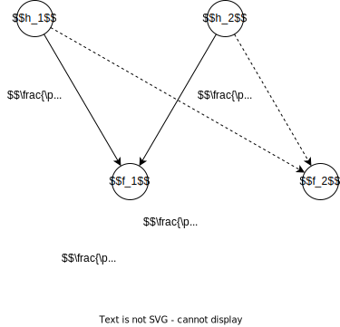

# Neural Network

## Backpropagation

- distribution of "global gradient" entries

  
  - a part of the computation graph
  - $h_i : \mathbb{R}^{m_i} \to \mathbb{R}$
  - $f_j : \mathbb{R}^{n_j} \to \mathbb{R}$
  - $h_i$ are the successors of $f_j$
  - $G$ is the graph
  - $w$ is the parameters of $f_1$

## References

- the repo on which mine is based - <https://github.com/pim-book/programmers-introduction-to-mathematics>
